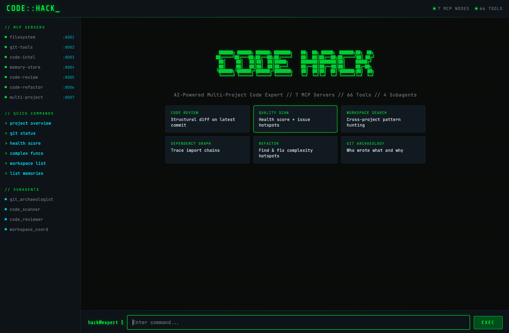
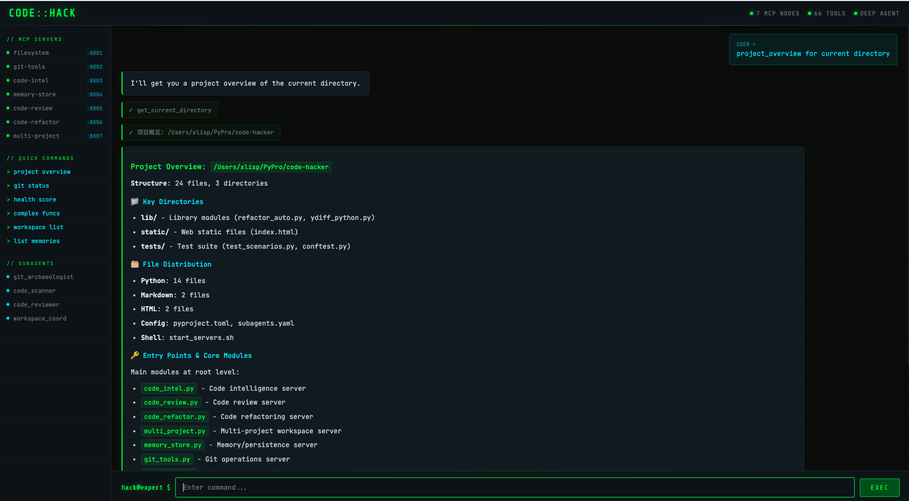
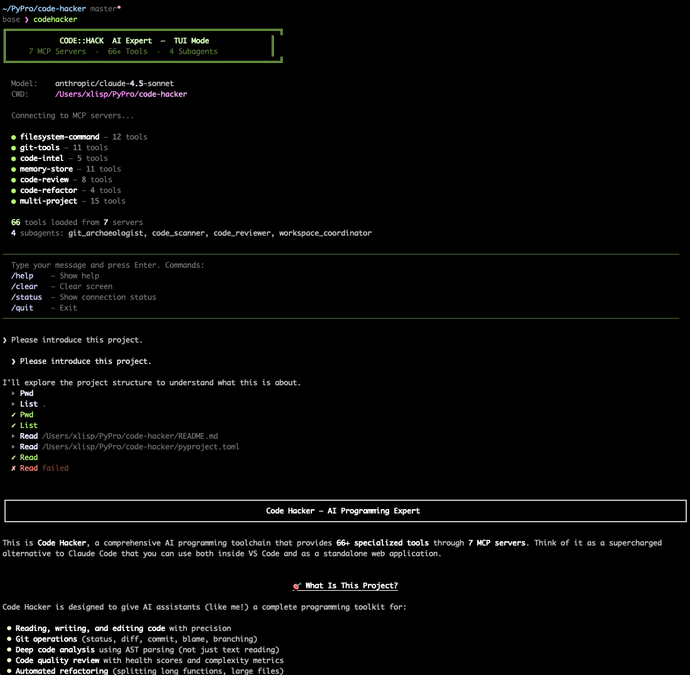
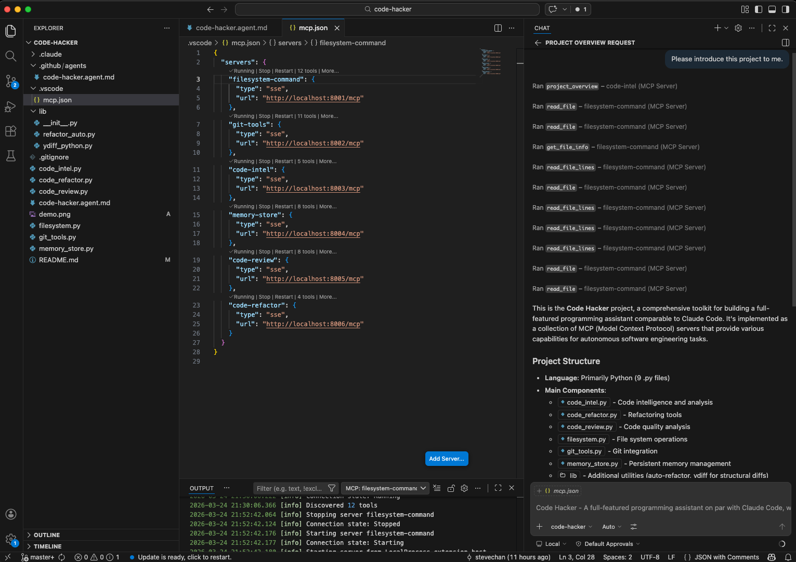

# Code Hacker — AI Programming Expert

**7 MCP Servers** powering **66+ tools** for a complete AI programming toolchain. Three ways to use:

| Mode | Description | Best For |
|------|-------------|----------|
| **VS Code Custom Agent** | `code-hacker.agent.md` + VS Code Copilot Chat | IDE-integrated development |
| **Web App (DeepAgent)** | `web_app.py` — standalone web UI with subagents | Full autonomous AI programming, multi-project coordination |
| **TUI (Terminal UI)** | `tui_app.py` — Claude Code-style terminal interface | SSH / headless servers / terminal-first workflow |

All three modes share the same 7 MCP servers — start once, use anywhere.






---

## Quick Start

### 1. Start All MCP Servers

```bash
bash start_servers.sh          # Start all 7 servers (ports 8001-8007)
bash start_servers.sh status   # Check server status
bash start_servers.sh stop     # Stop all servers
bash start_servers.sh restart  # Restart all servers
```

### 2a. Use with VS Code (Custom Agent)

See [VS Code Setup](#vs-code-setup) below — register servers in `settings.json`, place `.agent.md` in your project.

### 2b. Use with Web App (DeepAgent — Complete AI Programming Tool)

```bash
# Install dependencies
uv sync

# Start the web interface (requires OPENROUTER_API_KEY)
OPENROUTER_API_KEY=your-key uv run python web_app.py

# Open http://localhost:8000
```

### 2c. Use with TUI (Claude Code-style Terminal Interface)

```bash
# Start the TUI (requires OPENROUTER_API_KEY)
OPENROUTER_API_KEY=your-key uv run python tui_app.py
```

The TUI provides a **Claude Code-style terminal experience** — interactive prompt, streaming Markdown output with syntax highlighting, real-time tool call display (`⏵ Read` → `✓ Read`), command history (↑/↓), and slash commands (`/help`, `/clear`, `/status`, `/quit`). Built on Rich + prompt_toolkit, no extra dependencies required.

The web app (and TUI) is a **complete AI programming tool** built on [deepagents](https://github.com/anthropics/deepagents) (`create_deep_agent`):
- **66+ MCP tools** from all 7 servers, unified into a single autonomous agent
- **4 specialized subagents**: Git Archaeologist, Code Scanner, Code Reviewer, Workspace Coordinator
- **Persistent memory** via `FilesystemBackend` + `MemoryMiddleware`
- **Task planning** via `TodoListMiddleware`
- **Hacker-style terminal UI** — cyberpunk green-on-black aesthetic with real-time tool execution streaming

```
┌─────────────────────────────────────────────────────────────────────────┐
│  web_app.py (DeepAgent)                                                │
│                                                                         │
│  ┌───────────────────────────────────────────────────────────────────┐  │
│  │  create_deep_agent(                                               │  │
│  │    model = claude-sonnet-4-5 (via OpenRouter)                    │  │
│  │    tools = 66 tools from 7 MCP servers                           │  │
│  │    subagents = [git_archaeologist, code_scanner,                  │  │
│  │                 code_reviewer, workspace_coordinator]             │  │
│  │    memory = ["./AGENTS.md"]                                      │  │
│  │    backend = FilesystemBackend                                   │  │
│  │    middleware = [TodoList, Memory, Summarization, PatchToolCalls] │  │
│  │  )                                                                │  │
│  └──────────────┬────────────────────────────────────────────────────┘  │
│                 │ MCP Protocol (streamable-http)                        │
│  ┌──────────────▼────────────────────────────────────────────────────┐  │
│  │  filesystem:8001  git:8002  intel:8003  memory:8004               │  │
│  │  review:8005  refactor:8006  multi-project:8007                   │  │
│  └───────────────────────────────────────────────────────────────────┘  │
│                                                                         │
│  FastAPI + WebSocket → Hacker Terminal UI (http://localhost:8000)       │
└─────────────────────────────────────────────────────────────────────────┘
```

### 3. Run Integration Tests (LLM-powered)

```bash
# Requires MCP servers running + OPENROUTER_API_KEY
NO_PROXY=localhost,127.0.0.1 uv run pytest tests/test_scenarios.py -v -s

# Run a single scenario
NO_PROXY=localhost,127.0.0.1 uv run pytest tests/test_scenarios.py::test_ydiff_commit_review -v -s
```

13 real scenarios covering: ydiff commit review, project health score, git history investigation, Python AST analysis, cross-file search, dependency graph, workspace registration, memory save/recall, Jenkinsfile pipeline generation, complex function detection, git blame, QA experience recording, project overview.

```bash
# Unit tests for auto_refactor two-phase commit (no MCP servers needed)
uv run pytest tests/test_refactor_commit.py -v
```

Tests cover: `_git_commit` helper, two-phase commit separation (`#not-need-review` / `#need-review`), `auto_commit=False` mode, commit tag format, `git log --grep` filtering.

---

## Architecture

### Design Philosophy

What makes Claude Code powerful is that it's not just a chat window — it's an **autonomous programming Agent** with a complete toolchain. It can read code, edit code, search code, run commands, manage Git, and remember context, forming a closed-loop development workflow.

Code Hacker's design goal: **Replicate and surpass this closed-loop capability** — usable both within VS Code Copilot Chat and as a standalone DeepAgent web app.

Core ideas:
1. **Separation of Concerns** — Split Claude Code's capabilities into 7 independent MCP Servers, each doing one thing
2. **Composition over Inheritance** — Assemble multiple servers into a complete Agent via agent files or DeepAgent
3. **Three Frontends, One Backend** — VS Code, web_app.py, and tui_app.py share the same 7 MCP servers
4. **Security Sandbox** — Each server has independent security policies (path checks, command blocklists, file whitelists)
5. **Surpass, Not Imitate** — Code review and structural diff are capabilities Claude Code lacks, based on AST-level analysis and the ydiff algorithm
6. **Multi-Project First** — Real development involves multiple repos (frontend+backend, app+library, service+pipeline). The workspace system treats multi-repo as a first-class concept

### System Architecture Diagram

```
┌─────────────────────────────────────────────────────────────────────────────┐
│                       Three Frontends, One Backend                          │
│                                                                             │
│  ┌──────────────────┐  ┌──────────────────┐  ┌──────────────────────────┐  │
│  │ VS Code Copilot  │  │ web_app.py       │  │ tui_app.py              │  │
│  │ Chat             │  │ (DeepAgent)      │  │ (Claude Code-style TUI) │  │
│  │                  │  │                  │  │                          │  │
│  │ .agent.md     │  │ FastAPI+WS       │  │ Rich + prompt_toolkit   │  │
│  │ tools:           │  │ create_deep_agent│  │ create_deep_agent       │  │
│  │  filesystem-*/*  │  │ 4 subagents      │  │ 4 subagents             │  │
│  │  git-tools/*     │  │ Hacker Web UI    │  │ Terminal streaming      │  │
│  │  code-intel/*    │  │                  │  │ ⏵ Read → ✓ Read        │  │
│  │  memory-store/*  │  │ http://localhost  │  │ Markdown rendering      │  │
│  │  code-review/*   │  │       :8000      │  │ Command history ↑↓      │  │
│  │  code-refactor/* │  │                  │  │ /help /clear /status    │  │
│  │  multi-project/* │  │                  │  │                          │  │
│  └────────┬─────────┘  └────────┬─────────┘  └────────────┬─────────────┘  │
│           │                      │                          │               │
│           └──────────────────────┼──────────────────────────┘               │
│                                  │                                          │
│               ┌──────────────────▼─────────────────────┐                    │
│               │  7 MCP Servers (streamable-http)        │                    │
│               │  bash start_servers.sh                  │                    │
│               └──────────────────┬─────────────────────┘                    │
│                                  │                                          │
│  ┌───────────────────────────────▼───────────────────────────────────────┐  │
│  │                                                                        │  │
│  │  filesystem.py :8001 (12 tools)  │  git_tools.py :8002 (11 tools)     │  │
│  │   read/write/edit/find/search    │   status/diff/log/blame/branch     │  │
│  │   execute_command                │   add/commit/stash/checkout        │  │
│  │                                  │                                    │  │
│  │  code_intel.py :8003 (5 tools)   │  memory_store.py :8004 (11 t.)    │  │
│  │   AST analysis, symbols          │   save/get/search/scratchpad       │  │
│  │   project_overview, dep graph    │   qa_experience_*                  │  │
│  │                                  │                                    │  │
│  │  code_review.py :8005 (8 tools)  │  code_refactor.py :8006 (4 t.)    │  │
│  │   review_project/file/function   │   auto_refactor                   │  │
│  │   health_score, find_complex     │   ydiff_files/commit/changes       │  │
│  │                                  │                                    │  │
│  │  multi_project.py :8007 (15 tools)                                    │  │
│  │   workspace_add/search/edit/commit — cross-repo coordination          │  │
│  │                                                                        │  │
│  └────────────────────────────────────────────────────────────────────────┘  │
└─────────────────────────────────────────────────────────────────────────────┘
```

### MCP Server Responsibilities

| Server | File | Tools | Responsibility | Design Principle |
|--------|------|-------|----------------|------------------|
| **filesystem-command** | `filesystem.py` | 12 | File CRUD, precise editing, file search, command execution | The Agent's "hands" — foundation for all file operations. `edit_file` replicates Claude Code's Edit tool |
| **git-tools** | `git_tools.py` | 11 | Complete Git workflow | Dedicated tools are safer than generic commands. LLM calls structured functions without memorizing git syntax |
| **code-intel** | `code_intel.py` | 5 | Code understanding & analysis | AST parsing compensates for LLM weaknesses. `project_overview` generates a full project panorama in one call |
| **memory-store** | `memory_store.py` | 7 | Cross-session persistent memory | Structured JSON storage + categories/tags/search. `scratchpad` for complex reasoning |
| **code-review** | `code_review.py` | 8 | Code quality review | **Unique capability** — Claude Code doesn't have this. Self-contained AST analysis engine, quantifies code quality, locates hotspots, generates reorganization suggestions |
| **code-refactor** | `code_refactor.py` | 4 | Auto refactoring + structural diff | **Unique capability** — Auto-splits long functions/large files. ydiff AST-level diff generates interactive HTML reports |
| **multi-project** | `multi_project.py` | 15 | Multi-project workspace: cross-repo search, edit, git, coordinated commit | **Unique capability** — Claude Code can only work in one directory. This enables Jenkinsfile+library, frontend+backend, microservice coordination |

### Data Flow: Typical Scenarios

**Scenario A: Code Modification**
```
User: "Change all print statements to logging in the project"

  ① project_overview(".")             → Understand project structure
  ② search_files_ag("print(", "py")   → Locate all print statements
  ③ read_file_lines("app.py", 10, 25) → Confirm context
  ④ edit_file("app.py", old, new)     → Precise replacement
  ⑤ git_diff()                        → Verify changes
  ⑥ memory_save(...)                  → Remember progress
```

**Scenario B: AI Code Review (Code Hacker Exclusive)**
```
User: "Review this project's code quality"

  ① health_score("/path/to/project")         → Quick score: 72/100 (B)
  ② review_project("/path/to/project")       → Full scan: 5 critical + 12 medium
  ③ find_complex_functions(...)               → Locate TOP 5 complex functions
  ④ review_function("app.py", "process_data") → Deep analysis + refactoring suggestions
  ⑤ auto_refactor(..., apply=False)           → Preview auto-refactoring plan
  ⑥ auto_refactor(..., apply=True)            → Execute refactoring (two-phase commit)
     → commit 1: move code to modules  #not-need-review  ← reviewer 可跳过
     → commit 2: split long functions  #need-review      ← 需要人工审核
  ⑦ ydiff_commit(".", "HEAD")                → Generate structural diff HTML report
```

**Scenario C: Multi-Project Coordinated Edit (Code Hacker Exclusive)**
```
User: "The buildHelper function in the shared library changed, update Jenkinsfile too"

  ① workspace_add("/repos/shared-lib", alias="lib", role="library")
  ② workspace_add("/repos/my-app", alias="app", role="infra")
  ③ workspace_find_dependencies("buildHelper")       → Trace all references across repos
  ④ workspace_read_file("lib", "src/helper.py")      → Read library source
  ⑤ workspace_edit_file("lib", "src/helper.py", ...) → Edit library code
  ⑥ workspace_edit_file("app", "Jenkinsfile", ...)   → Update pipeline accordingly
  ⑦ workspace_git_status()                           → Verify all changes across repos
  ⑧ workspace_commit("lib,app", "feat: update buildHelper signature and pipeline")
```

**Scenario D: Review AI-Generated Code**
```
User: "Review this AI-generated code for me"

  ① review_diff_text(old_code, new_code)  → Compare old/new code structural changes
     → Added 3 functions, removed 1, modified 2
     → ⚠ process_all: complexity 8→15↑, exceeds threshold
     → ⚠ handle_request: too long (62 lines)
  ② review_function(...)                   → Deep analysis of problematic functions
  ③ edit_file(...)                         → Fix issues
```

### Security Architecture

```
┌─────────────────────────────────────────┐
│     Security Layer (independent per      │
│                server)                   │
├─────────────────────────────────────────┤
│                                         │
│  filesystem.py:                         │
│    ├─ Path safety check (blocks .. traversal) │
│    ├─ File type whitelist (text files only)    │
│    ├─ File size limit (10MB)            │
│    ├─ Command blocklist (rm/format/dd/...)     │
│    └─ Command timeout (30s)             │
│                                         │
│  git_tools.py:                          │
│    ├─ All operations via git subcommands│
│    ├─ No force push / reset --hard      │
│    └─ Command timeout (30s)             │
│                                         │
│  code_intel.py:                         │
│    ├─ Read-only operations              │
│    └─ Search result limits (prevent OOM)│
│                                         │
│  memory_store.py:                       │
│    ├─ Data isolation (.agent-memory/)   │
│    └─ JSON format, auditable            │
│                                         │
│  code_review.py:                        │
│    └─ All tools are read-only           │
│                                         │
│  code_refactor.py:                      │
│    ├─ auto_refactor defaults to preview │
│    ├─ .bak backup before refactoring    │
│    ├─ Two-phase commit: #not-need-review│
│    │   + #need-review for easy filtering│
│    └─ ydiff only generates HTML reports │
│                                         │
│  multi_project.py:                      │
│    ├─ File type whitelist (same policy) │
│    ├─ Command blocklist (rm/format/dd)  │
│    ├─ Command timeout (30s)             │
│    └─ Workspace config in .agent-memory │
│                                         │
└─────────────────────────────────────────┘
```

---

## Comparison with Claude Code

### Feature-by-Feature Comparison

| Capability | Claude Code | Code Hacker | Winner |
|-----------|------------|-------------|--------|
| **File Reading** | `Read` — supports line numbers, PDF, images | `read_file` + `read_file_lines` | Claude Code (multimodal) |
| **File Writing** | `Write` — create or overwrite | `write_file` + `append_file` | Tie |
| **Precise Editing** | `Edit` — old→new replacement | `edit_file` — same pattern | Tie |
| **File Search** | `Glob` — ripgrep | `find_files` — pathlib.rglob | Claude Code (faster) |
| **Content Search** | `Grep` — ripgrep | `search_files_ag` — Silver Searcher | Tie |
| **Command Execution** | `Bash` — full shell, background | `execute_command` — security sandbox | Claude Code (more powerful) / Code Hacker (safer) |
| **Git Operations** | `Bash` + git commands | 11 dedicated git tools | **Code Hacker** |
| **Code Analysis** | LLM reading | AST parsing + symbol extraction | **Code Hacker** |
| **Project Understanding** | `Agent` multi-round exploration | `project_overview` one-call | **Code Hacker** |
| **Dependency Analysis** | None | `dependency_graph` | **Code Hacker** |
| **Persistent Memory** | Markdown filesystem | Structured JSON + categories/tags | **Code Hacker** |
| **Web Access** | `WebFetch` + `WebSearch` | `fetch` (VS Code built-in) | Claude Code (search) |
| **Code Review** | No dedicated tools | `review_project/file/function` + `health_score` | **Code Hacker Exclusive** |
| **Auto Refactoring** | None | `auto_refactor` — auto-split functions/files | **Code Hacker Exclusive** |
| **Structural Diff** | None (line-level diff only) | `ydiff_files/commit/git_changes` — AST-level | **Code Hacker Exclusive** |
| **Change Review** | None | `review_diff_text` — quantify old/new code differences | **Code Hacker Exclusive** |
| **Multi-Project Workspace** | Single directory only | `workspace_*` — 15 tools for cross-repo search, edit, git, coordinated commit | **Code Hacker Exclusive** |
| **HTML Reports** | None | `generate_report` — visual quality reports | **Code Hacker Exclusive** |
| **Sub-agents** | `Agent` parallel spawning | 4 DeepAgent subagents (web_app.py) | Tie |
| **Images/PDF** | Supported | Not supported | Claude Code |
| **Notebook** | `NotebookEdit` | Not supported | Claude Code |

### Advantage Summary

**Code Hacker Exclusive/Superior (10 items):**
- **Code Review**: `review_project/file/function` quantifies code quality — Claude Code has nothing comparable
- **Auto Refactoring**: `auto_refactor` auto-splits long functions and large files, with preview + execute modes. **Two-phase commit**: mechanical moves → `#not-need-review`, logic splits → `#need-review`
- **Structural Diff**: `ydiff_files/commit` AST-based diff that understands code moves/renames — Claude Code only has line-level diff
- **Change Review**: `review_diff_text` compares old/new code structural changes, quantifies complexity direction
- **Multi-Project Workspace**: `workspace_*` 15 tools for cross-repo search, edit, git, coordinated commit — Claude Code is locked to a single directory
- **Health Score**: `health_score` one-click project scoring 0-100
- Git Operations: 11 structured tools vs. hand-written git commands
- Code Analysis: Precise AST parsing vs. LLM reading/guessing
- Project Overview: Single call vs. multi-round exploration
- Memory System: Structured JSON vs. Markdown files

**Claude Code Superior (4 items):**
- Command Execution: Full Bash shell + pipes + background processes
- Multimodal: Image + PDF reading
- Web Search: Search engine retrieval
- Notebook Editing

### Coverage

```
Claude Code Core Capability Coverage:

  File Operations  ████████████████████  100%  (Read/Write/Edit/Glob/Grep)
  Git Operations   ████████████████████  100%  (even finer-grained)
  Command Exec     ██████████████░░░░░░   70%  (missing background, pipes)
  Code Analysis    ████████████████████  100%+ (AST parsing surpasses)
  Persistent Mem   ████████████████████  100%+ (structured storage surpasses)
  Code Review      ████████████████████  ∞%   (Claude Code lacks this)
  Structural Diff  ████████████████████  ∞%   (Claude Code lacks this)
  Auto Refactor    ████████████████████  ∞%   (Claude Code lacks this)
  Multi-Project    ████████████████████  ∞%   (Claude Code lacks this)
  Web Access       ██████████████░░░░░░   70%  (missing search engine)
  Sub-agents       ████████████████████  100%  (4 subagents in web_app.py)
  Multimodal       ░░░░░░░░░░░░░░░░░░░░    0%  (MCP limitation)
  Notebook         ░░░░░░░░░░░░░░░░░░░░    0%  (can be extended later)
  ─────────────────────────────────────────
  Shared capability coverage    ~85%
  Unique capabilities           +4 dimensions surpassing Claude Code
```

---

## Project Files

```
.
├── start_servers.sh           # Start/stop/status/restart all 7 MCP servers
├── web_app.py                 # DeepAgent web interface (FastAPI + WebSocket)
├── tui_app.py                 # Claude Code-style TUI (Rich + prompt_toolkit)
├── subagents.yaml             # 4 subagent definitions for DeepAgent
├── static/
│   └── index.html             # Hacker-style terminal UI
├── filesystem.py              # MCP 1: File read/write, edit, search, command exec (12 tools)
├── git_tools.py               # MCP 2: Full Git operations (11 tools)
├── code_intel.py              # MCP 3: AST analysis, symbol extraction, dependency graph (5 tools)
├── memory_store.py            # MCP 4: Persistent memory + scratchpad + QA experience (11 tools)
├── code_review.py             # MCP 5: Code quality review (8 tools)
├── code_refactor.py           # MCP 6: Auto refactoring + structural diff (4 tools)
├── multi_project.py           # MCP 7: Multi-project workspace — cross-repo ops (15 tools)
├── lib/
│   ├── __init__.py
│   ├── ydiff_python.py        # AST structural diff engine
│   └── refactor_auto.py       # Auto-refactoring engine (function/file splitting)
├── tests/
│   ├── conftest.py            # LLM test fixtures (DeepAgent session, run_agent_query)
│   ├── test_scenarios.py      # 13 real code hack scenarios (LLM-powered pytest)
│   └── test_refactor_commit.py # Unit tests: two-phase commit strategy (#not-need-review / #need-review)
├── code-hacker.agent.md    # VS Code agent definition (system prompt + tool bindings)
├── .vscode/
│   └── mcp.json               # MCP server registration (reference; actual config in user settings)
├── pyproject.toml             # Dependencies (deepagents, langchain, mcp, fastapi, ...)
└── README.md
```

## Prerequisites

- **Python** 3.11+
- **Git**
- **uv** (recommended) or pip

For VS Code mode:
- **VS Code** 1.99+
- **GitHub Copilot Chat** extension

For Web App / TUI mode:
- **OPENROUTER_API_KEY** (or OPENAI_API_KEY)

```bash
# Install dependencies
uv sync          # recommended
# or: pip install mcp deepagents langchain langchain-openai langchain-mcp-adapters langgraph fastapi uvicorn
```

Optional (recommended): Install [The Silver Searcher](https://github.com/ggreer/the_silver_searcher) for faster code search:

```bash
# macOS
brew install the_silver_searcher
# Ubuntu/Debian
sudo apt install silversearcher-ag
# Termux
pkg install the_silver_searcher
```

You can also set the `AG_PATH` environment variable to specify a custom path to the `ag` binary.

## Installation & Configuration

### Step 1: Start MCP Servers

All 7 MCP servers use streamable-http transport. Start them all at once with:

```bash
bash start_servers.sh          # Start all 7 servers
bash start_servers.sh status   # Check which servers are running
bash start_servers.sh stop     # Stop all servers
bash start_servers.sh restart  # Restart all servers
```

Or start individually:

```bash
python filesystem.py      # Port 8001
python git_tools.py       # Port 8002
python code_intel.py      # Port 8003
python memory_store.py    # Port 8004
python code_review.py     # Port 8005
python code_refactor.py   # Port 8006
python multi_project.py   # Port 8007
```

> **Note:** If you have a local HTTP proxy (e.g., on port 7890), set `NO_PROXY=localhost,127.0.0.1` before starting clients to avoid 502 errors.

Once servers are running, you can use them with **any combination** of VS Code, Web App, and TUI — all three can run simultaneously.

<a id="vs-code-setup"></a>
### Step 2 (VS Code): Register MCP Servers

Open `settings.json` (`Ctrl+Shift+P` → `Preferences: Open User Settings (JSON)`) and add the following:

```json
{
  "mcp": {
    "servers": {
      "filesystem-command": {
        "type": "sse",
        "url": "http://localhost:8001/mcp"
      },
      "git-tools": {
        "type": "sse",
        "url": "http://localhost:8002/mcp"
      },
      "code-intel": {
        "type": "sse",
        "url": "http://localhost:8003/mcp"
      },
      "memory-store": {
        "type": "sse",
        "url": "http://localhost:8004/mcp"
      },
      "code-review": {
        "type": "sse",
        "url": "http://localhost:8005/mcp"
      },
      "code-refactor": {
        "type": "sse",
        "url": "http://localhost:8006/mcp"
      },
      "multi-project": {
        "type": "sse",
        "url": "http://localhost:8007/mcp"
      }
    }
  }
}
```

### Step 3 (VS Code): Verify MCP Connection

After adding the configuration, VS Code's status bar will show MCP server status. Ensure all 7 servers are shown as connected.

If not connected, check:
- All 7 server processes are running (`bash start_servers.sh status`)
- Ports 8001-8007 are not occupied by other processes

### Step 4 (VS Code): Place Agent File

Place `code-hacker.agent.md` in the **project root directory** you want to use it in.

> Key configuration — the `tools` field must use the `server-name/*` wildcard format:
> ```yaml
> tools: ["filesystem-command/*", "git-tools/*", "code-intel/*", "memory-store/*", "code-review/*", "code-refactor/*", "multi-project/*", "fetch"]
> ```
> `fetch` is a VS Code built-in tool and requires no additional configuration.

### Step 5 (VS Code): Start Using

1. Open the project containing `code-hacker.agent.md` in VS Code
2. Open the Copilot Chat panel (`Ctrl+Shift+I`)
3. Select **Code Hacker** in the **mode selector** at the top
4. Start chatting

> **Troubleshooting:** If Code Hacker doesn't appear in the mode selector:
> - Confirm VS Code >= 1.99
> - Confirm `.agent.md` file is in the workspace root
> - Restart VS Code

### Step 2 (Web App): Start DeepAgent Web Interface

```bash
# Set your API key
export OPENROUTER_API_KEY=your-key

# Optional: customize models
export LLM_MODEL=anthropic/claude-sonnet-4-5-20250514    # main agent
export LLM_SUBAGENT_MODEL=anthropic/claude-haiku-4-5-20251001  # subagents (cheaper)
export LLM_BASE_URL=https://openrouter.ai/api/v1

# Start the web app
uv run python web_app.py

# Open http://localhost:8000
```

The web app connects to all 7 MCP servers, loads 66+ tools, creates a DeepAgent with 4 subagents, and serves a WebSocket-based chat UI with real-time tool execution streaming.

### Step 2 (TUI): Start Claude Code-style Terminal Interface

```bash
# Set your API key
export OPENROUTER_API_KEY=your-key

# Start the TUI
uv run python tui_app.py
```

The TUI provides the same DeepAgent backend as the web app but with a terminal-native interface:
- **Streaming output** with Rich Markdown rendering and syntax highlighting
- **Tool call display** in Claude Code style: `⏵ Read file.py` → `✓ Read`
- **Command history** with ↑/↓ arrow keys
- **Slash commands**: `/help`, `/clear`, `/status`, `/quit`
- **Interrupt support**: Ctrl+C to cancel current operation

Ideal for SSH sessions, headless servers, or developers who prefer staying in the terminal.

## Full Tool List

### filesystem-command (12 tools)

| Tool | Description |
|------|-------------|
| `read_file` | Read file content, supports utf-8/gbk/gb2312 encodings |
| `read_file_lines` | Read specific line range, suitable for large files |
| `write_file` | Write to file |
| `append_file` | Append content to file |
| `edit_file` | **Precise string replacement** (pass old_string → new_string) |
| `find_files` | Glob pattern recursive file search |
| `search_files_ag` | Regex file content search (similar to ripgrep) |
| `list_directory` | List directory contents |
| `get_file_info` | File details (size, timestamps, permissions) |
| `create_directory` | Recursively create directories |
| `get_current_directory` | Get working directory |
| `execute_command` | Execute system commands (dangerous commands blocked) |

### git-tools (11 tools)

| Tool | Description |
|------|-------------|
| `git_status` | Working tree status |
| `git_diff` | View changes (supports staged) |
| `git_log` | Commit history |
| `git_show` | View commit content or file at specific revision |
| `git_branch` | List branches |
| `git_create_branch` | Create new branch |
| `git_checkout` | Switch branches/restore files |
| `git_add` | Stage files |
| `git_commit` | Commit |
| `git_stash` | Stash management (push/pop/list) |
| `git_blame` | Line-by-line change attribution |

### code-intel (5 tools)

| Tool | Description |
|------|-------------|
| `analyze_python_file` | Python AST deep analysis (classes, functions, imports, docstrings) |
| `extract_symbols` | Extract symbol definitions (Python/JS/TS/Java/Go/Rust) |
| `project_overview` | Project panorama (directory tree, language distribution, entry points, config) |
| `find_references` | Cross-file symbol reference search |
| `dependency_graph` | File import/imported-by relationship analysis |

### memory-store (7 tools)

| Tool | Description |
|------|-------------|
| `memory_save` | Save memory (supports categories and tags) |
| `memory_get` | Retrieve specific memory |
| `memory_search` | Search memories (by keyword/category/tag) |
| `memory_list` | List all memories |
| `memory_delete` | Delete memory |
| `scratchpad_write/read/append` | Temporary scratchpad (for complex reasoning) |

### code-review (8 tools)

| Tool | Description |
|------|-------------|
| `review_project` | Scan entire project: health score + issue list + reorganization suggestions |
| `review_file` | Single file analysis, functions ranked by complexity |
| `review_function` | Deep analysis of a specific function with concrete refactoring suggestions |
| `health_score` | Quick project health score (0-100) |
| `find_long_functions` | Longest functions ranking |
| `find_complex_functions` | Highest complexity functions ranking |
| `suggest_reorg` | File reorganization suggestions (by naming patterns and class distribution) |
| `review_diff_text` | Compare old/new code strings, analyze change impact |

### code-refactor (4 tools)

| Tool | Description |
|------|-------------|
| `auto_refactor` | Auto refactoring: split long functions and large files, with **two-phase commit** (mechanical `#not-need-review` + logic `#need-review`) |
| `ydiff_files` | Structural AST-level diff: compare two Python files |
| `ydiff_commit` | Git commit structural diff, multi-file HTML report |
| `ydiff_git_changes` | Compare structural changes between any two git refs |

### multi-project (15 tools)

| Tool | Description |
|------|-------------|
| `workspace_add` | Register a project into the workspace (with alias, role, description) |
| `workspace_remove` | Remove a project from the workspace |
| `workspace_list` | List all projects with live git status |
| `workspace_overview` | High-level overview of all projects (languages, configs, structure) |
| `workspace_search` | Regex/text search across all workspace projects |
| `workspace_find_files` | Glob pattern file search across all projects |
| `workspace_find_dependencies` | Trace a symbol across all projects (cross-repo impact analysis) |
| `workspace_read_file` | Read a file from any project by alias |
| `workspace_edit_file` | Precise string replacement in any project |
| `workspace_write_file` | Write/create a file in any project |
| `workspace_git_status` | Bird's-eye git status across all repos |
| `workspace_git_diff` | Diff summary across all repos |
| `workspace_git_log` | Recent commits across all repos |
| `workspace_commit` | Coordinated commit with same message across multiple repos |
| `workspace_exec` | Execute a shell command in the context of any project |

### VS Code Built-in

| Tool | Description |
|------|-------------|
| `fetch` | Fetch web page/API content |

## Usage Examples

```
You: Analyze this project's architecture
→ project_overview → find_files → analyze_python_file → output analysis report

You: Change all print statements to logging
→ search_files_ag to locate → read_file_lines to confirm context → edit_file to replace each

You: Who introduced this bug?
→ git_blame → git_show → locate the commit and author that introduced the bug

You: Remember: this project's API should use the /api/v2 prefix
→ memory_save to persist, auto-recalled in next session

You: Look up FastAPI middleware docs
→ fetch to retrieve documentation content and summarize

You: Register my frontend and backend repos, then search for all API endpoints
→ workspace_add × 2 → workspace_search("@app.route\|@router") across both repos

You: The shared library's buildHelper changed, update the Jenkinsfile too
→ workspace_find_dependencies("buildHelper") → workspace_edit_file × 2 → workspace_commit

You: Show me what's changed across all my projects
→ workspace_git_status → workspace_git_diff
```

## Customization & Extension

### Add File Type Whitelist

Edit `ALLOWED_EXTENSIONS` in `filesystem.py`.

### Modify Command Blocklist

Edit `BLOCKED_COMMANDS` in `filesystem.py`.

### Adjust Agent Behavior

Edit the system prompt in `code-hacker.agent.md`.

### Add New MCP Server

1. Create a new `.py` file using `FastMCP` to define tools
2. Run it with SSE transport on an available port
3. Register the server URL in VS Code `settings.json`
4. Add `"new-server-name/*"` to the `tools` field in `code-hacker.agent.md`

## License

MIT
